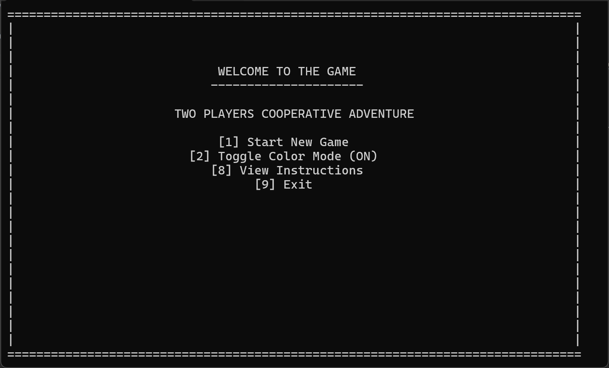
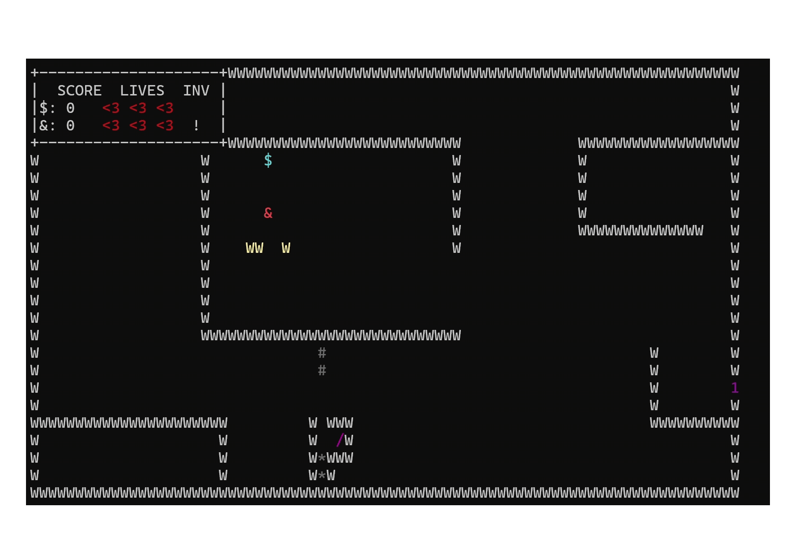
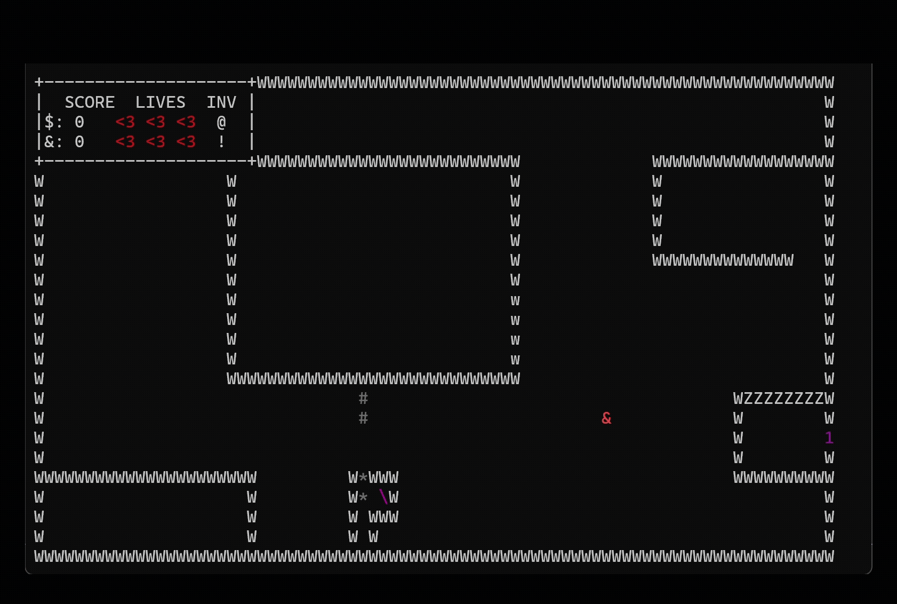
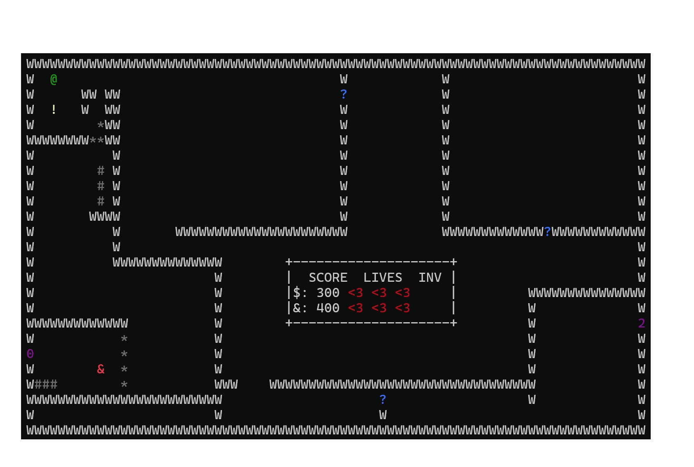
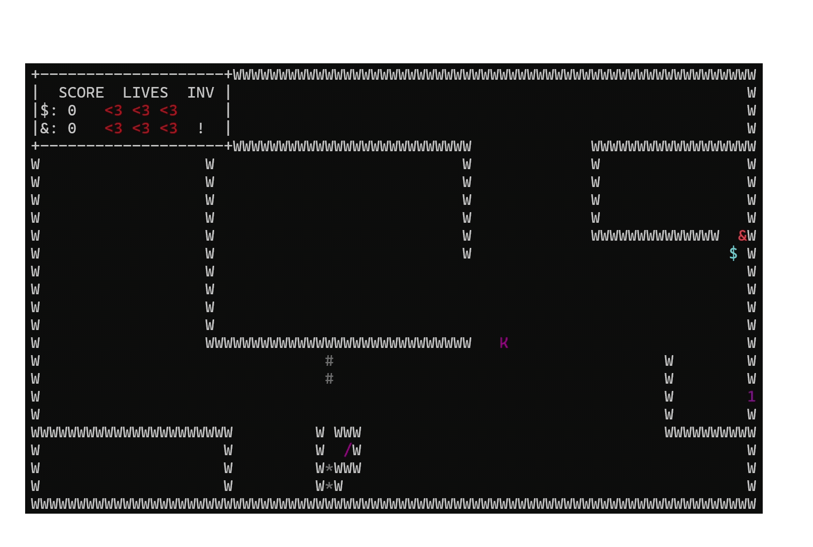
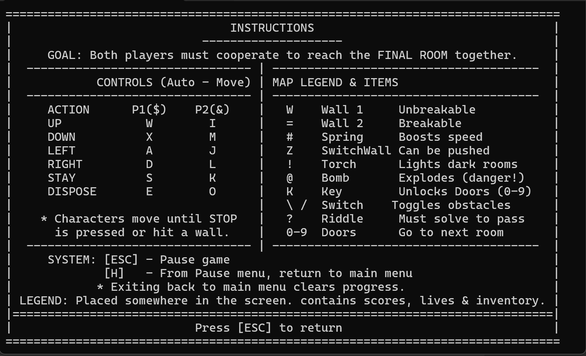

<div align="center">

# 🏰 Dungeon Co-op — Two-Player Console Adventure Engine

**A fully-featured cooperative dungeon crawler built from scratch in C++17 — no game frameworks, no libraries, just raw systems programming.**

`C++17` · `8,000+ Lines` · `40+ Source Files` · `Cross-Platform` · `macOS / Linux / Windows`

<br/>



*Main menu — running in an 80×25 terminal window with color mode*

<br/>

<table>
<tr>
<td><br/><sub>Fog-of-war with torch illumination</sub></td>
<td><br/><sub>Bomb explosion with LOS blast radius</sub></td>
</tr>
<tr>
<td><br/><sub>Physics-based pushable obstacles</sub></td>
<td><br/><sub>Animated riddle popup system</sub></td>
</tr>
</table>

</div>

---

## ⚡ Why This Project Stands Out

This isn't a homework submission — it's an **engine**. Two players share a keyboard and cooperate in real-time across multi-room dungeons, solving puzzles, dodging explosions, and navigating fog-of-war darkness. Every system — rendering, physics, input, recording — was hand-built.

| What I Built | Why It Matters |
|---|---|
| 🧪 **Deterministic replay & silent testing framework** | Record gameplay → replay with seeded RNG → verify events automatically. This is, fundamentally, an **automated game QA pipeline** — the exact problem space Duzz.ai operates in. |
| 🏗️ **4-level OOP hierarchy with polymorphic dispatch** | `GameObject` → `StaticObject`/`PickableObject`/`InteractableObject` → 10+ concrete types. Factory pattern, virtual clone, clean separation of concerns. |
| 🌑 **Fog-of-war visibility engine** | Dark zones with ray-traced line-of-sight, torch illumination radius, 4-level visibility states (`DARK` → `EDGE` → `INNER` → `CLOSE`). |
| 🧲 **Custom physics system** | Momentum-based spring launchers, Bresenham line traversal for multi-step movement, force-based pushable obstacles. |
| 💣 **Explosion system with LOS calculation** | Bombs with fuse timers, circular blast radius, wall occlusion via line-of-sight checks, chain destruction of breakable objects. |
| 🖥️ **Cross-platform console abstraction** | Single codebase renders to Windows (`conio.h`), macOS, and Linux (`termios`) — clean `#ifdef` separation, ANSI escape codes, non-blocking I/O. |

---

## 🧪 The Testing Framework — Built for QA

> *This is the system most relevant to Duzz.ai's mission of autonomous game testing.*

The game has a built-in **record → replay → verify** pipeline — a miniature version of the automated QA systems that Duzz.ai builds at scale:

```
┌─────────────┐      ┌──────────────┐      ┌────────────────┐
│  SAVE MODE  │ ───▶ │  LOAD MODE   │ ───▶ │  SILENT MODE   │
│ Records all │      │ Replays from │      │ Headless run,  │
│ player I/O  │      │ steps file   │      │ diffs results  │
└─────────────┘      └──────────────┘      └────────────────┘
```

- **Deterministic seeded RNG** ensures identical riddle assignment across record and replay.
- **Screen file checksums** at replay time catch level-file drift between sessions.
- **Event-level verification** — screen changes, life losses, riddle outcomes are diffed line-by-line.
- **Factory pattern** (`Game::createFromArgs()`) instantiates `NormalGame` or `LoadedGame` from CLI args — zero coupling between play and test modes.

```bash
# Record a session
./game -save

# Replay it visually
./game -load

# Run headless verification (CI-friendly)
./game -load -silent
# → "Test passed" or "Test not passed"
```

---

## 🏗️ Architecture

```
                        ┌──────────────┐
                        │  GameObject  │  ← abstract base (virtual clone, draw, update)
                        └──────┬───────┘
              ┌────────────────┼────────────────┐
              ▼                ▼                ▼
      ┌──────────────┐  ┌──────────────┐  ┌────────────────┐
      │ StaticObject │  │PickableObject│  │InteractableObj │
      └──────┬───────┘  └──────┬───────┘  └───────┬────────┘
             │                 │                  │
    ┌────┬───┴───┬───┐     ┌───┼────┐       ┌─────┼─────┐
    │    │       │   │     │   │    │       │     │     │
  Wall Break- Switch Air  Key Torch Bomb   Door Switch Riddle
        able   Wall          
        Wall

              ┌──────────┐
              │   Game   │  ← abstract base (Factory pattern)
              └────┬─────┘
           ┌───────┴───────┐
           ▼               ▼
     ┌───────────┐  ┌────────────┐
     │NormalGame │  │ LoadedGame │  ← replay/silent testing
     └───────────┘  └────────────┘
```

**Key design patterns**: Factory Method · Polymorphism · Virtual Clone · Template Method · Composition (Room ↔ GameObject) · Singleton-style static instance (`Game::currentInstance`)

---

## 🎮 Game Features

### 🗝️ Cooperative Puzzle Rooms
Both players must work together — collecting keys, activating switches, navigating doors, and solving multiple-choice riddles — to reach the final room. Each room is an 80×25 ASCII map loaded from `.screen.txt` files with metadata.

### 🌑 Darkness & Torches
Rooms can define rectangular dark zones. Without a torch, these areas are completely hidden. Picking up a torch creates a real-time illumination radius with graduated visibility.

<p align="center"></p>

### 💣 Bombs & Explosions
Placeable bombs with a 50-tick fuse and a 5-cell blast radius. Explosions check **line-of-sight** to avoid blasting through walls, can destroy breakable obstacles, trigger switches, and eliminate keys (causing game-over if critical items are lost). Includes a blinking fuse animation and post-explosion visual effect.

<p align="center"></p>

### 🧲 Springs & Physics
Multi-cell spring objects compressed by player movement. When fully compressed, they launch the player using a **momentum system** with Bresenham-based multi-step traversal — the player slides across the room until hitting a wall or obstacle.

### 🧱 Pushable Obstacles
Multi-block obstacles with computed edge detection and weight-based force requirements. Players push them by walking into them — heavier obstacles need more force (or springs).

<p align="center"></p>

### ❓ Riddle Popups
Walking into a `?` triggers an animated popup overlay with a multiple-choice question. Correct answers clear the path; wrong answers deduct a life.

<p align="center"></p>

---

## 🕹️ Controls

Both players share one keyboard. Input is **case-insensitive**. Characters auto-move and will keep going until they hit a wall or press STAY.

| Action | Player 1 (`$`) | Player 2 (`&`) |
|---|:---:|:---:|
| ↑ UP | `W` | `I` |
| ↓ DOWN | `X` | `M` |
| ← LEFT | `A` | `J` |
| → RIGHT | `D` | `L` |
| ■ STAY | `S` | `K` |
| ⬇ DISPOSE | `E` | `O` |

> `ESC` → Pause · `H` (from pause) → Main Menu

<details>
<summary><strong>📋 Instructions Screen</strong></summary>
<br/>

<p align="center"></p>

</details>

---

## 🛠️ Build & Run

```bash
# Clone
git clone https://github.com/YOUR_USERNAME/cpp_project_2025.git
cd cpp_project_2025

# Build (requires g++ with C++17 support)
make

# Play
./game

# Play with color mode
# → Press [2] in the main menu to toggle color mode

# Record a session for testing
./game -save

# Replay
./game adv-world.steps.txt

# Silent verification (headless, CI-ready)
./game adv-world.steps.txt -silent
```

**Requirements**: Any C++17-capable compiler (`g++`, `clang++`). No external dependencies.

---

## 🗺️ Level Editor

Create custom rooms by adding `adv-worldXX.screen.txt` files (auto-discovered via `std::filesystem`). Each file is an 80×25 ASCII map followed by a metadata block:

| Symbol | Object | Behavior |
|:---:|---|---|
| `W` | Wall | Indestructible |
| `w` | Breakable Wall | Destroyed by bombs |
| `#` | Spring | Launches players |
| `*` | Obstacle | Pushable block |
| `Z` | Switch Wall | Removed when switches activate |
| `K` | Key | Unlocks doors |
| `!` | Torch | Illuminates dark zones |
| `@` | Bomb | Pickup → place → explode |
| `\` `/` | Switch | Toggles obstacles/doors |
| `?` | Riddle | Multiple-choice puzzle |
| `0-9` | Door | Requires keys/switches to pass |
| `L` | Legend Anchor | HUD placement marker |

```text
---METADATA---
SPAWN 3 10                     # Player spawn point
SPAWN_PREV 75 17               # Spawn when returning from next room
NEXT_ROOM 1                    # Next room ID (-1 = final room)
PREV_ROOM -1                   # Previous room ID (-1 = first room)
DOOR 1 2 0                     # Door 1 needs 2 keys, 0 switches
DARK_ZONE 20 5 46 14           # Dark rectangle (top-left → bottom-right)
```

---

## 📂 Project Structure

```
.
├── main.cpp                    # Entry point
├── Game.h/cpp                  # Abstract base — state machine, room management
├── NormalGame.h/cpp            # Live gameplay + recording mode
├── LoadedGame.h/cpp            # Replay + silent verification mode
├── Player.h/cpp                # Movement, physics, inventory, collisions
├── Room.h/cpp                  # Room state, visibility, object management
├── GameObject.h/cpp            # Abstract game object base class
├── Bomb.h/cpp                  # Explosive with fuse timer + LOS blast
├── Spring.h/cpp                # Compressible launcher with momentum
├── Obstacle.h/cpp              # Multi-block pushable physics objects
├── Riddle.h/cpp                # Animated popup quiz system
├── Recorder.h/cpp              # Action serialization / deserialization
├── LevelLoader.h/cpp           # Map parser + std::filesystem discovery
├── Console.h                   # Cross-platform terminal abstraction
├── Renderer.h                  # Silent-mode-aware rendering proxy
├── Momentum.h/cpp              # Velocity / launch frame tracking
├── Makefile                    # Build configuration
├── riddle.txt                  # Riddle question database
└── adv-world*.screen.txt       # Level files (3 included)
```

---

## 👤 Author

**Etay De Beer**

Built as a C++ collage course project — evolved into a full game engine with QA automation, physics, fog-of-war, and extensible level design.

---

<div align="center">
<sub>Built with ❤️, raw C++, and zero game frameworks.</sub>
</div>
